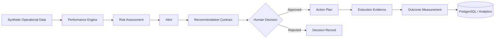

# Supply Chain Digital Control Tower 2.0

**Business Operations | Digital Transformation | Data, Automation & AI Engineering**

A recruiter-facing portfolio edition of a governed supply-chain decision-support platform. It demonstrates how operational data can be transformed into measurable, controlled business action using deterministic analytics, automation, human decision gates, and auditable outcome tracking.

> **Portfolio Edition:** This repository intentionally demonstrates the architecture and engineering approach without publishing the full proprietary intelligence, policy thresholds, remediation logic, or production integrations used in the private development edition.

## Business Problem

Supply-chain teams often identify supplier-performance problems across disconnected reports, transactional systems, spreadsheets, and manual follow-up processes. Detecting a KPI problem is only the beginning: teams still need to understand risk, decide what to do, control execution, preserve evidence, and measure whether the intervention worked.

This project connects that decision lifecycle into one governed workflow.

## Demonstrated Vertical Slice

```text
Operational Data
      ↓
OTD Calculation
      ↓
Supplier Risk Signal
      ↓
Operational Alert
      ↓
Governed Recommendation
      ↓
Human Approval
      ↓
Corrective Action
      ↓
Execution Evidence
      ↓
Outcome Measurement
```

The portfolio edition focuses on **supplier On-Time Delivery (OTD) recovery** as a representative business scenario.

## What This Repository Demonstrates

- deterministic KPI calculation;
- supplier-risk assessment from synthetic operational data;
- governed alert generation;
- recommendation contracts without exposing proprietary policy logic;
- explicit human approval before operational action;
- action and evidence tracking;
- business-outcome measurement;
- PostgreSQL-oriented persistence design;
- Python domain modeling;
- automated tests for representative business rules;
- separation between business logic, persistence, and presentation.

## Architecture



### Design Principles

**Process before AI.** The business process and control requirements are defined before introducing AI capabilities.

**Deterministic core.** Financial and operational rules that require reproducibility remain deterministic.

**Human authority.** Decision support does not equal authority to act. Material operational actions require explicit human approval.

**Traceability by design.** Recommendations, decisions, actions, evidence, and outcomes should be traceable.

**Evidence before complexity.** New technical complexity must produce measurable business or engineering value.

## Technology

- Python
- PostgreSQL / SQL
- Pydantic-style domain contracts
- pytest
- Docker-oriented local persistence
- Power BI / analytics-ready outputs
- Streamlit-compatible presentation layer

## Repository Structure

```text
src/
  contracts/       # public domain contracts
  performance/     # representative deterministic KPI logic
  risk/            # simplified portfolio risk assessment
  workflow/        # human-governed vertical slice

tests/             # representative automated validation

data/sample/       # synthetic demonstration data only

docs/
  architecture.md  # public high-level architecture
  business_case.md # business problem and measurable outcomes
```

## Governance Boundary

This portfolio project does **not** autonomously:

- approve recommendations;
- place or modify purchase orders;
- communicate with suppliers;
- update ERP records;
- make unrestricted AI decisions.

Human-issued decisions remain mandatory for material operational actions.

## Data & Confidentiality

All demonstration data in this repository is synthetic. No employer, customer, supplier, ERP, purchase-order, contract, or confidential operational data is included.

## Private vs. Portfolio Edition

The private development edition contains additional architecture, policy engines, intelligence components, decision provenance, advanced remediation playbooks, and implementation detail. Those elements are intentionally excluded or simplified here.

This public-facing edition is designed to provide enough technical evidence to evaluate the engineering approach while protecting differentiated implementation logic.

## Current Status

**Portfolio Edition:** In development  
**Demonstrated scope:** OTD recovery vertical slice  
**Purpose:** Technical portfolio / architecture demonstration

## Author

**René Crucci**  
Business Operations | Digital Transformation | Data, Automation & AI Engineering
