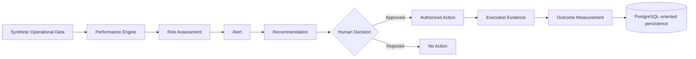

# Supply Chain Digital Control Tower 2.0

**Business Operations | Digital Transformation | Data, Automation & AI Engineering**

A recruiter-facing portfolio edition of a governed supply-chain decision-support platform. It demonstrates how operational data can move from **measurement → risk → recommendation → human decision → action evidence → outcome measurement** without giving automated intelligence unrestricted authority to act.

> **Portfolio Edition:** this repository intentionally proves the architecture and engineering approach without publishing the complete private intelligence, policy thresholds, remediation logic, or enterprise integrations.

## 60-Second Overview

**Business problem:** a KPI can identify poor supplier performance, but a dashboard alone does not create a controlled recovery process.

**Demonstrated solution:** a synthetic OTD recovery workflow that calculates performance deterministically, identifies a material risk signal, creates a governed recommendation, requires accountable human approval, and measures the later business outcome.

**Engineering evidence:** Python domain contracts, deterministic business logic, automated tests, a PostgreSQL-oriented schema, synthetic data, CI, and an executable end-to-end demo.

**Governance principle:** **intelligence to recommend ≠ authority to act.**

## Demonstrated Vertical Slice

```text
Synthetic Delivery Data
        ↓
Deterministic OTD
        ↓
Risk Assessment
        ↓
Operational Alert
        ↓
Recommendation
        ↓
Human Decision Gate
        ↓
Authorized Action State
        ↓
Execution Evidence
        ↓
Outcome Measurement
```

The public slice focuses on supplier On-Time Delivery (OTD) recovery. Public risk thresholds are illustrative portfolio values and are deliberately different from the richer private policy/intelligence implementation.

## Architecture



See [`docs/architecture.md`](docs/architecture.md) for the sanitized architecture and [`docs/business_case.md`](docs/business_case.md) for the business case.

## Quick Start

Requires Python 3.11+.

```bash
python -m pip install pytest
pytest
python demo.py
```

Representative demo output:

```text
Supplier: SYN-SUP-001
Baseline OTD: 50.0%
Risk: HIGH
Recommendation: Review delivery-recovery options with the accountable owner
Authorization: HUMAN_APPROVED_ACTION_READY
Synthetic outcome: 72% -> 84% (+12.0 pp)
Causation claim: NOT ESTABLISHED
```

The follow-up outcome is synthetic and intentionally does not claim that the intervention caused the observed change.

## What the Code Proves

- `src/contracts/models.py` — immutable public domain contracts for delivery, performance, risk, recommendation, human decision, and outcome measurement.
- `src/performance/otd.py` — deterministic OTD calculation.
- `src/risk/portfolio.py` — intentionally simplified public risk assessment.
- `src/workflow/recovery.py` — alert, recommendation, and explicit human-authorization boundary.
- `tests/test_portfolio_workflow.py` — representative business-rule and governance tests.
- `db/schema.sql` — simplified PostgreSQL schema with integrity constraints and decision/evidence relationships.
- `data/sample/deliveries.csv` — synthetic demonstration data only.
- `.github/workflows/ci.yml` — automated test and demo validation on repository changes.

## Design Principles

**Process before AI.** Define the business process and control requirements before introducing AI capabilities.

**Deterministic core.** Rules requiring reproducibility remain deterministic and testable.

**Human authority.** Recommendations cannot authorize themselves. Material operational action requires an explicit human decision.

**Traceability by design.** Decisions, actions, evidence, and outcomes are represented separately so the path can be audited.

**No unsupported causal claims.** Outcome measurement reports observed change without automatically asserting causation.

## Technology Demonstrated in This Edition

- Python 3.11+
- SQL / PostgreSQL-oriented relational design
- Python dataclasses and enums for domain contracts
- pytest
- GitHub Actions CI
- synthetic-data modeling

The private development edition contains broader analytics and application-layer capabilities; this repository only claims technologies directly demonstrated here.

## Governance Boundary

This portfolio project does **not** autonomously:

- approve recommendations;
- place or modify purchase orders;
- communicate with suppliers;
- update ERP records;
- make unrestricted AI decisions.

Human-issued decisions remain mandatory for material operational actions.

## Data, Security & Confidentiality

All demonstration data is synthetic. No employer, customer, supplier, ERP, purchase-order, contract, email, part-number, credential, or confidential operational data is intended to be included. See [`SECURITY.md`](SECURITY.md).

## What Is Intentionally Private

The recruiter edition does not publish the complete private implementation of:

- policy thresholds and policy catalogs;
- scenario intelligence;
- advanced recommendation logic;
- remediation playbooks;
- predictive intelligence;
- AI-copilot internals;
- decision provenance/replay internals;
- enterprise integrations.

This boundary protects differentiated implementation while leaving enough working code to evaluate how the business problem was translated into software.

## Status

**Portfolio Edition:** pre-release / recruiter review  
**Demonstrated scope:** governed OTD recovery vertical slice  
**Data:** synthetic only

## Author

**René Crucci**  
**Business Operations | Digital Transformation | Data, Automation & AI Engineering**
